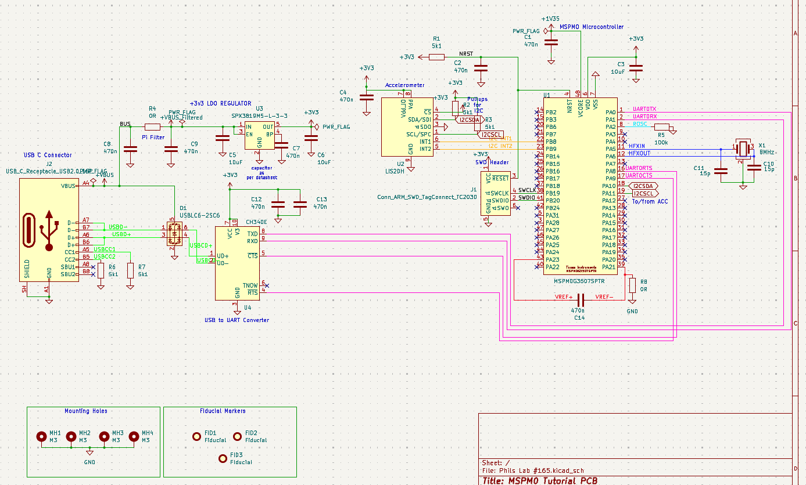
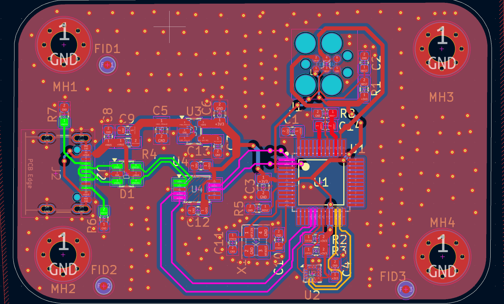
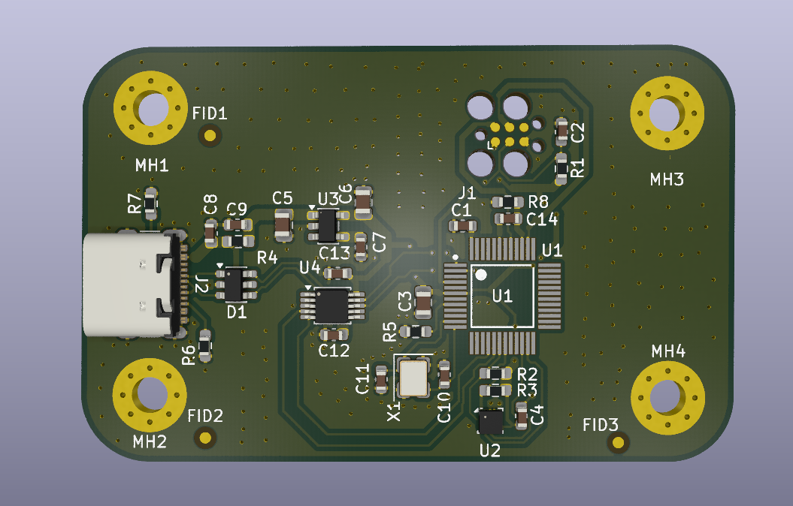
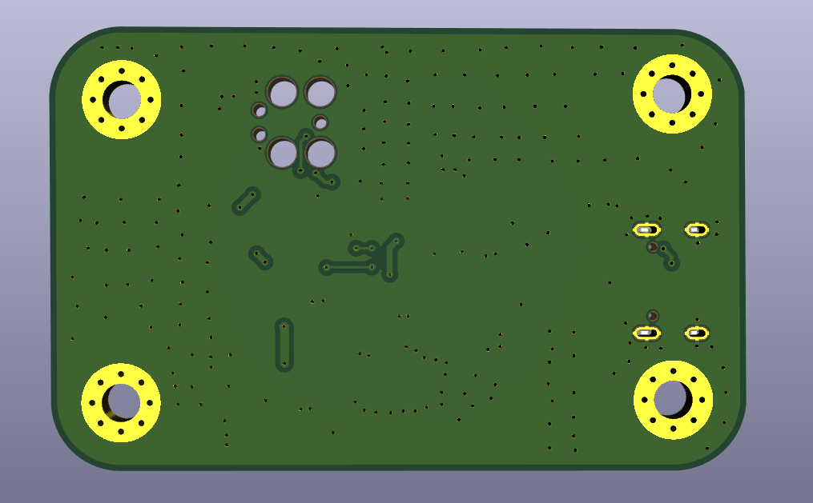

# Phil's Lab #165

KiCad project files for Phil's Lab video #165.

## Schematic

## PCB Layout

## 3D View (Top)

## 3D View (Bottom)

1. Install [KiCad](https://www.kicad.org/download/).
2. Open `Phils Lab #165.kicad_pro`.
3. Use the Schematic Editor and PCB Editor from the project window.
